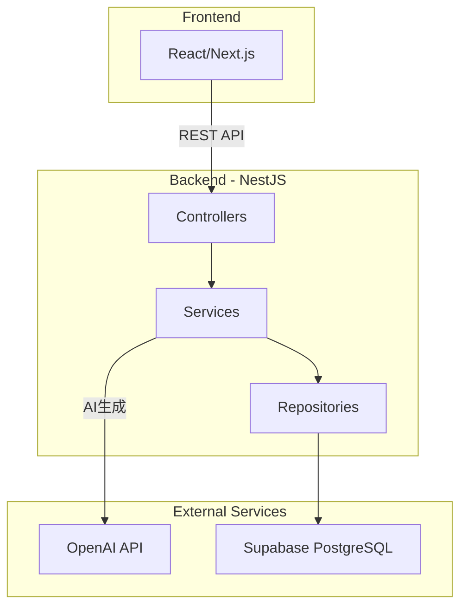
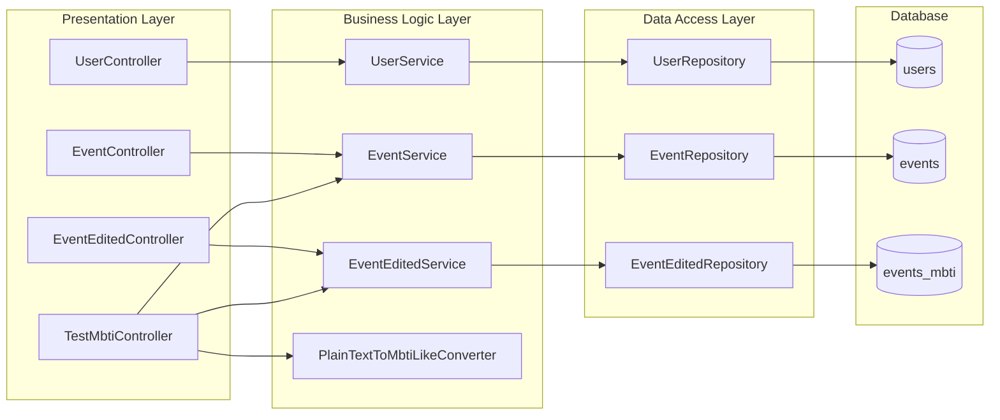
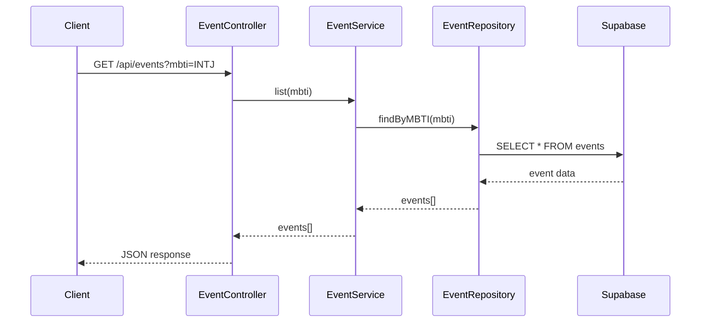
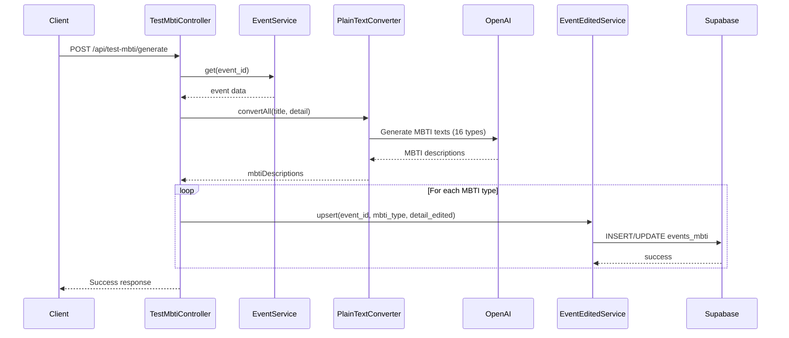
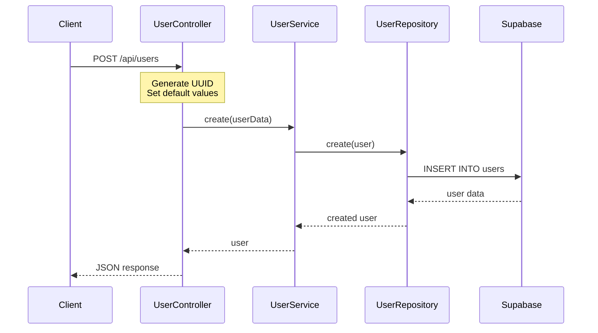
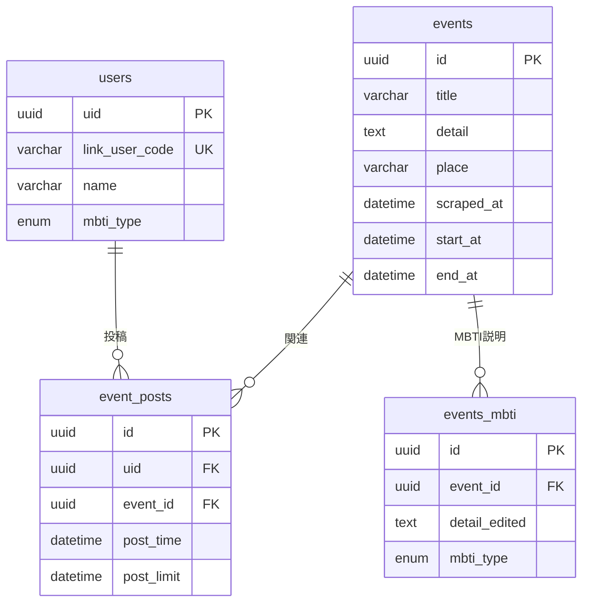
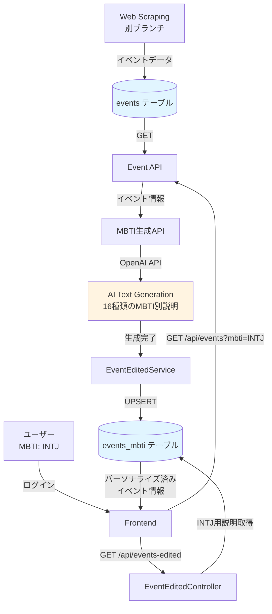

# Link-Rits-back アーキテクチャ

## システム概要

立命館大学のイベント情報を、ユーザーのMBTIタイプに合わせてパーソナライズして提供するバックエンドシステム。

## 技術スタック

### 使用技術
- **Framework**: NestJS (TypeScript)
- **Database**: Supabase (PostgreSQL)
- **AI**: OpenAI GPT API
- **Authentication**: Auth0 (予定)
- **Scraping**: (別ブランチ実装済み)

## システムアーキテクチャ

### レイヤー構成

## データフロー

### 1. イベント取得フロー

### 2. MBTI生成＆保存フロー

### 3. ユーザー作成フロー

## データベーススキーマ

## API エンドポイント

### Users API
- `POST /api/users` - ユーザー作成
- `GET /api/users/:link_user_code` - ユーザー取得
- `PUT /api/users/:link_user_code` - ユーザー更新

### Events API
- `GET /api/events?mbti=XXXX` - イベント一覧取得
- `GET /api/events/:event_id` - イベント詳細取得

### Events_mbti API
- `POST /api/events-edited` - MBTI別説明作成
- `GET /api/events-edited?event_id=XXX&mbti_type=XXX` - MBTI別説明取得

### Test/MBTI API
- `POST /api/test-mbti/generate` - AI生成＆保存（統合フロー）
- `GET /api/test-mbti/verify?event_id=XXX` - 保存データ確認

## 全体フロー（スクレイピング → AI生成 → 配信）

## 実装済み機能

✅ **Core Infrastructure**
- SupabaseClient DI (Dependency Injection)
- Repository Pattern実装
- Service Layer実装

✅ **API Endpoints**
- User CRUD
- Event取得
- Events_mbti CRUD
- MBTI生成統合フロー

✅ **AI Integration**
- OpenAI GPT連携
- MBTI 16種類別文言生成
- バッチ処理（全MBTIタイプ一括生成）

## 今後の拡張

🔄 **予定機能**
- スクレイピング機能のマージ
- Auth0認証統合
- イベント投稿機能（event_posts）
- レコメンデーション機能強化
